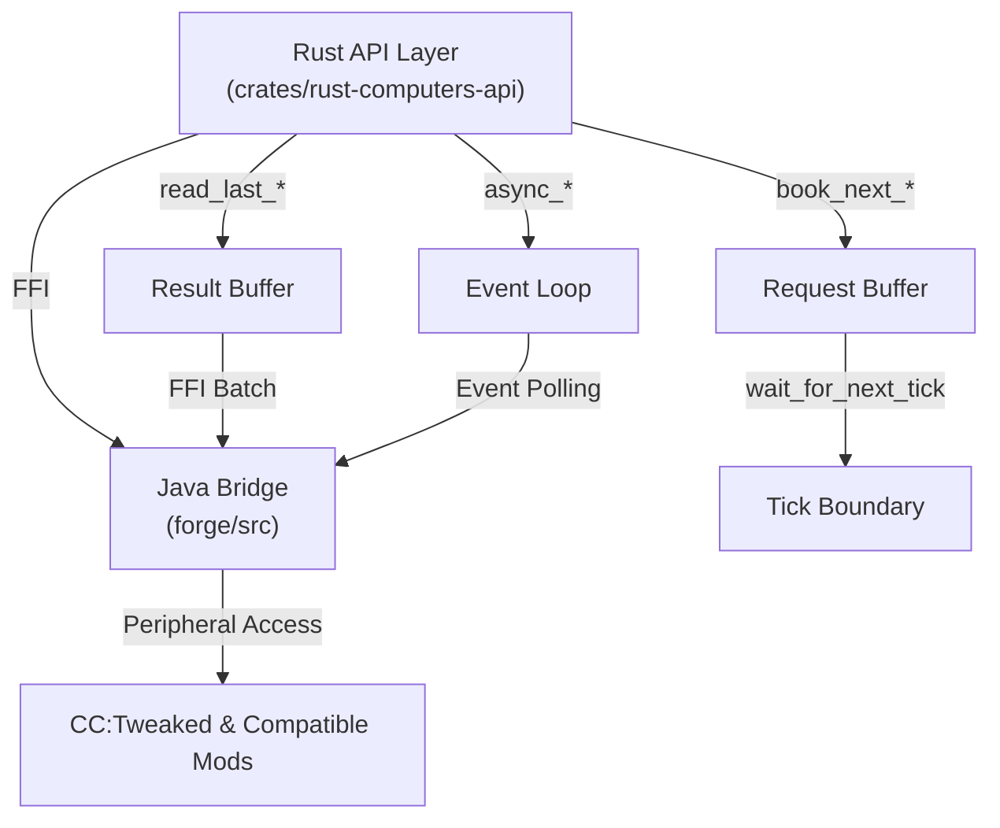

# Design Document: CC:Tweaked互換性改善プロジェクト

## Overview

RustComputersのCC:Tweaked互換性を大幅に改善するプロジェクト。現在、APIの過不足とイベント系の実装がほぼ行われていない状況を解決する。提案された修正プランでは、関数を3つのペアで提供する（`book_next_*` / `read_last_*` / `async_*`）ことで、情報取得系・ワールド干渉系の両方に対応し、Luaのループが進まない動作を再現する。

## Architecture



## API Design Pattern: Three-Function Pairs

### Pattern Overview

各ペリフェラルメソッドは以下の3つの形式で提供される：

1. **`book_next_*(&mut self, args) -> ()`**
   - リクエストを予約（FFI呼び出しなし）
   - 情報取得系：最後のリクエストのみ有効（上書き）
   - ワールド干渉系：全て保存（追記）

2. **`read_last_*(&self) -> Result<T, PeripheralError>`**
   - 前tickの結果を読み取り
   - 情報取得系：1つの結果（最新）を返す
   - ワールド干渉系：複数の結果（全操作の結果）を返す `Vec<Result<T, PeripheralError>>`

3. **`async_*(&self, args) -> Result<T, PeripheralError>`**
   - `.await`で結果を取得
   - 内部的に book → wait → read をループ
   - イベント駆動メソッドに対応
   - Luaのループが進まない動作を再現

### Usage Pattern

```rust
// 情報取得系の例
let mut sensor = find_imm::<Sensor>().unwrap();

// 初回予約
sensor.book_next_get_data();
wait_for_next_tick().await;

loop {
    // 前tickの結果を読み取り
    let data = sensor.read_last_get_data()?;
    
    // 処理
    process(&data);
    
    // 次tickのリクエストを予約
    sensor.book_next_get_data();
    wait_for_next_tick().await;
}

// または async_* を使用
let data = sensor.async_get_data().await?;
```

```rust
// ワールド干渉系の例
let mut motor = find_imm::<Motor>().unwrap();

loop {
    // 複数の操作を予約
    motor.book_next_set_speed(100);
    motor.book_next_set_direction(Direction::Forward);
    wait_for_next_tick().await;
    
    // 全操作の結果を取得
    let results = motor.read_last_set_speed()?;  // Vec<Result<(), PeripheralError>>
    
    // または async_* を使用
    motor.async_set_speed(100).await?;
}
```

## Event System Implementation

### Event Booking and Polling

イベント系メソッドは以下の流れで実装される：

1. **`book_next_someevent(&mut self)`**
   - イベント受信をリクエスト
   - 複数回呼び出し可能（複数リクエスト）

2. **`read_last_someevent(&self) -> Vec<Option<T>>`**
   - 複数リクエスト・複数回答形式
   - `Vec<Option<T>>`で返す（イベント未発生時はNone）

3. **`async_someevent(&self) -> Result<T, PeripheralError>`**
   - `.await`でイベント受信まで待機
   - イベント発生までReadyにならない
   - Luaのループが進まない動作を再現

### Event Loop Behavior

```
GT N   [Rust]  → book_next_someevent() で予約
GT N   [Rust]  → wait_for_next_tick().await で FFI 一括発行
GT N+1 [Java]  → イベント監視開始
GT N+1 [Rust]  → read_last_someevent() で結果確認（イベント未発生ならNone）
GT N+2 [Java]  → イベント発生
GT N+2 [Rust]  → read_last_someevent() でイベント取得
```

### Modem Event Example

```rust
let mut modem = find_imm::<Modem>().unwrap();

// 方法1: book-read パターン
modem.book_next_receive_raw();
wait_for_next_tick().await;

loop {
    if let Some(msg) = modem.read_last_receive_raw()? {
        process_message(&msg);
    }
    
    modem.book_next_receive_raw();
    wait_for_next_tick().await;
}

// 方法2: async パターン（推奨）
let msg = modem.async_receive_raw().await?;
process_message(&msg);
```

## Compatible Mods Peripheral Inventory

### 1. CC:Tweaked (computercraft)

**Peripherals:**
- `Inventory` - インベントリ操作
- `Modem` - ネットワーク通信
- `Monitor` - 画面表示
- `Speaker` - 音声出力

**Implementation Status:**
- Inventory: 部分実装（book_next/read_last）
- Modem: 部分実装（イベント未実装）
- Monitor: 部分実装（イベント未実装）
- Speaker: 部分実装

**Missing APIs:**
- Modem: `receive_raw`, `receive`, `transmit` イベント
- Monitor: `touch` イベント
- Inventory: 複数操作の結果取得

### 2. AdvancedPeripherals (advancedperipherals)

**Peripherals:**
- `BlockReader` - ブロック情報読取
- `ChatBox` - チャット監視
- `ColonyIntegrator` - Minecolonies連携
- `Compass` - 方角検出
- `EnergyDetector` - エネルギー検出
- `EnvironmentDetector` - 環境情報検出
- `GeoScanner` - 地形スキャン
- `InventoryManager` - インベントリ管理
- `MEBridge` - Applied Energistics連携
- `NBTStorage` - NBT保存
- `PlayerDetector` - プレイヤー検出
- `RSBridge` - Redstone信号ブリッジ

**Implementation Status:** 部分実装（多くのAPIが未実装）

**Priority APIs:**
- `MEBridge`: `getItems`, `getItemDetail`, `getFluidDetail`
- `PlayerDetector`: `getPlayers`, `getPlayerPos` イベント
- `GeoScanner`: `scan` 結果取得

### 3. CC-VS (cc_vs)

**Peripherals:**
- `Aerodynamics` - 空気力学計算
- `Drag` - 抗力計算
- `Ship` - 船舶制御

**Implementation Status:** 最小限の実装

### 4. Clockwork CC Compat (clockwork_cc_compat)

**Peripherals:**
- `AirCompressor` - 空気圧縮
- `Boiler` - ボイラー制御
- `CoalBurner` - 石炭燃焼
- `DuctTank` - ダクトタンク
- `Exhaust` - 排気制御
- `GasEngine` - ガスエンジン
- `GasNetwork` - ガスネットワーク
- `GasNozzle` - ガスノズル
- `GasPump` - ガスポンプ
- `GasThruster` - ガススラスター
- `GasValve` - ガスバルブ
- `Radiator` - ラジエーター
- `RedstoneDuct` - Redstoneダクト

**Implementation Status:** 未実装

### 5. Control-Craft (controlcraft)

**Peripherals:**
- `Camera` - カメラ制御
- `CannonMount` - キャノンマウント
- `CompactFlap` - コンパクトフラップ
- `DynamicMotor` - ダイナミックモーター
- `FlapBearing` - フラップベアリング
- `Jet` - ジェット制御
- `KinematicMotor` - キネマティックモーター
- `KineticResistor` - キネティック抵抗
- `LinkBridge` - リンクブリッジ
- `PropellerController` - プロペラコントローラー
- `Slider` - スライダー
- `SpatialAnchor` - 空間アンカー
- `Spinalyzer` - スピナライザー
- `Transmitter` - トランスミッター

**Implementation Status:** 未実装

### 6. Create (create)

**Peripherals:**
- `CreativeMotor` - クリエイティブモーター
- `DisplayLink` - ディスプレイリンク
- `Frogport` - フロッグポート
- `NixieTube` - ニキシー管
- `Packager` - パッケージャー
- `Postbox` - ポストボックス
- `RedstoneRequester` - Redstone要求者
- `Repackager` - リパッケージャー
- `RotationSpeedController` - 回転速度コントローラー
- `SequencedGearshift` - シーケンスギアシフト
- `Signal` - シグナル
- `Speedometer` - スピードメーター
- `Station` - ステーション
- `Sticker` - ステッカー
- `StockTicker` - ストックティッカー
- `Stressometer` - ストレスメーター
- `TableclothShop` - テーブルクロスショップ
- `TrackObserver` - トラックオブザーバー

**Implementation Status:** 部分実装

### 7. Create Additions (createaddition)

**Peripherals:**
- `DigitalAdapter` - デジタルアダプター
- `ElectricMotor` - 電気モーター
- `ModularAccumulator` - モジュラーアキュムレーター
- `PortableEnergyInterface` - ポータブルエネルギーインターフェース
- `RedstoneRelay` - Redstoneリレー

**Implementation Status:** 部分実装

### 8. Some-Peripherals (some_peripherals)

**Peripherals:**
- `BallisticAccelerator` - 弾道加速器
- `Digitizer` - デジタイザー
- `GoggleLink` - ゴーグルリンク
- `Radar` - レーダー
- `Sensor` - センサー
- `Transposer` - トランスポーザー

**Implementation Status:** 部分実装

### 9. Toms-Peripherals (toms_peripherals)

**Peripherals:**
- `Barometer` - 気圧計
- `Compass` - コンパス
- `Geiger` - ガイガーカウンター
- `Hygrometer` - 湿度計
- `Thermometer` - 温度計
- `Torch` - 懐中電灯
- `Wireless` - ワイヤレス

**Implementation Status:** 部分実装

### 10. CBC CC Control (cbc_cc_control)

**Peripherals:**
- `CompactCannonMount` - コンパクトキャノンマウント

**Implementation Status:** 最小限の実装

### 11. VS-Addition (vs_addition)

**Peripherals:**
- 未確認（Valkyrien Skies 2 関連）

**Implementation Status:** 未実装

## Implementation Strategy

### Phase 1: API Specification & Research

**Tasks:**
1. 各互換対象modの仕様確認
   - Lua APIドキュメント調査
   - 実装されているメソッド一覧作成
   - イベント仕様の確認

2. 調査結果をまとめる
   - `docs/lua_api/` に各modの仕様ドキュメント作成
   - APIの過不足を明確化
   - イベント仕様を文書化

**Deliverables:**
- `docs/lua_api/{mod_name}/` - 各modの仕様ドキュメント
- `docs/lua_api/COMPATIBILITY_MATRIX.md` - 互換性マトリックス

### Phase 2: Java Side Implementation

**Tasks:**
1. ペリフェラルブリッジの拡張
   - 既存の `PeripheralProvider` を拡張
   - イベント監視機構の実装
   - 複数リクエスト・複数回答の対応

2. 各modのペリフェラル実装
   - `forge/src/main/java/com/rustcomputers/peripheral/impl/` に実装
   - book-read パターンに対応
   - イベント監視に対応

**Deliverables:**
- `forge/src/main/java/com/rustcomputers/peripheral/impl/{ModName}Peripherals.java`
- イベント監視フレームワーク

### Phase 3: Rust API Implementation

**Tasks:**
1. ペリフェラルラッパー生成フレームワーク
   - `book_next_*`, `read_last_*`, `async_*` の自動生成
   - マクロベースの実装

2. 各modのペリフェラル実装
   - `crates/rust-computers-api/src/{mod_name}/` に実装
   - 3つの関数ペアを提供
   - イベント対応

**Deliverables:**
- `crates/rust-computers-api/src/{mod_name}/mod.rs`
- 各ペリフェラルの実装ファイル

### Phase 4: Documentation

**Tasks:**
1. APIリファレンス作成
   - `docs/api_en/{mod_name}/` - 英語ドキュメント
   - `docs/api_ja/{mod_name}/` - 日本語ドキュメント

2. 使用例とチュートリアル
   - book-read パターンの例
   - async パターンの例
   - イベント処理の例

**Deliverables:**
- `docs/api_en/{mod_name}/{Peripheral}.md`
- `docs/api_ja/{mod_name}/{Peripheral}.md`
- `docs/TUTORIAL.md` - 使用チュートリアル

## Java Side Implementation Details

### Peripheral Bridge Architecture

```java
// ペリフェラル情報の保持
class AttachedPeripheral {
    int id;                    // ペリフェラルID
    String type;               // ペリフェラルタイプ
    IPeripheral peripheral;    // CC:Tweaked IPeripheral
    Map<String, Integer> methods;  // メソッド名 → メソッドID
}

// リクエスト・結果の管理
class PeripheralRequestBuffer {
    Map<Integer, List<PendingRequest>> requests;  // ペリフェラルID → リクエスト
    Map<Integer, List<Object>> results;           // ペリフェラルID → 結果
}

// イベント監視
class EventMonitor {
    Map<Integer, List<EventListener>> listeners;  // ペリフェラルID → リスナー
    void pollEvents();
}
```

### Request Execution Flow

```
1. Rust → book_next_*() で予約
2. Rust → wait_for_next_tick().await で FFI 一括発行
3. Java → PeripheralProvider.executeRequests() で実行
4. Java → 結果をバッファに保存
5. Rust → read_last_*() で結果取得
```

### Event Polling Flow

```
1. Rust → book_next_someevent() で監視開始
2. Java → EventMonitor.pollEvents() で監視
3. Java → イベント発生時に結果バッファに追加
4. Rust → read_last_someevent() で結果取得
```

## Rust Side Implementation Details

### Peripheral Wrapper Pattern

```rust
pub struct SomePeripheral {
    addr: PeriphAddr,
}

impl SomePeripheral {
    // 情報取得系
    pub fn book_next_get_data(&mut self) {
        peripheral::book_request(self.addr, "getData", &[]);
    }
    
    pub fn read_last_get_data(&self) -> Result<Data, PeripheralError> {
        let bytes = peripheral::read_result(self.addr, "getData")?;
        decode::<Data>(&bytes)
    }
    
    pub async fn async_get_data(&self) -> Result<Data, PeripheralError> {
        self.book_next_get_data();
        wait_for_next_tick().await;
        self.read_last_get_data()
    }
    
    // ワールド干渉系
    pub fn book_next_set_value(&mut self, value: i32) {
        let args = encode(&value)?;
        peripheral::book_action(self.addr, "setValue", &args);
    }
    
    pub fn read_last_set_value(&self) -> Vec<Result<(), PeripheralError>> {
        peripheral::read_action_results(self.addr, "setValue")
    }
    
    pub async fn async_set_value(&mut self, value: i32) -> Result<(), PeripheralError> {
        self.book_next_set_value(value);
        wait_for_next_tick().await;
        self.read_last_set_value().into_iter().next().unwrap_or(Ok(()))
    }
    
    // イベント系
    pub fn book_next_receive_event(&mut self) {
        peripheral::book_request(self.addr, "receiveEvent", &[]);
    }
    
    pub fn read_last_receive_event(&self) -> Vec<Option<Event>> {
        // 複数リクエスト・複数回答形式
        peripheral::read_event_results(self.addr, "receiveEvent")
    }
    
    pub async fn async_receive_event(&self) -> Result<Event, PeripheralError> {
        loop {
            self.book_next_receive_event();
            wait_for_next_tick().await;
            
            if let Some(event) = self.read_last_receive_event()?.into_iter().next().flatten() {
                return Ok(event);
            }
        }
    }
}
```

### Macro-Based Generation

将来的には、マクロベースでペリフェラルラッパーを自動生成することを検討：

```rust
#[peripheral]
pub struct SomePeripheral {
    #[request]
    pub fn get_data() -> Data;
    
    #[action]
    pub fn set_value(value: i32) -> ();
    
    #[event]
    pub fn receive_event() -> Event;
}
```

## Correctness Properties

### Property 1: Request Ordering

**Assertion:**
```
∀ requests: List<Request>,
  book_next_*(requests[i]) followed by wait_for_next_tick().await
  ⟹ read_last_*() returns result for requests[i]
```

**Meaning:** 予約したリクエストは必ず実行され、結果が返される。

### Property 2: Action Accumulation

**Assertion:**
```
∀ actions: List<Action>,
  book_next_action_*(actions[i]) for all i
  ⟹ read_last_action_*() returns Vec with len(results) = len(actions)
```

**Meaning:** 複数のアクションを予約した場合、全てのアクションが実行され、全ての結果が返される。

### Property 3: Event Polling Termination

**Assertion:**
```
∀ event: Event,
  async_receive_event().await
  ⟹ eventually returns event when event occurs
```

**Meaning:** イベント待機は、イベント発生時に必ず終了する。

### Property 4: Tick Boundary Consistency

**Assertion:**
```
∀ tick: GameTick,
  book_next_*() at tick N
  ⟹ read_last_*() at tick N returns None or cached result
  ⟹ read_last_*() at tick N+1 returns result from tick N request
```

**Meaning:** リクエストと結果の取得は1tick遅れで一貫性を保つ。

### Property 5: Immutability of _imm Methods

**Assertion:**
```
∀ method: ImmMethod,
  method_imm() at tick N
  ⟹ returns result immediately without waiting for next tick
```

**Meaning:** _imm メソッドは同一tick内で即座に結果を返す。

## Error Handling Strategy

### Error Types

```rust
pub enum PeripheralError {
    NotFound,                    // ペリフェラルが見つからない
    MethodNotFound,              // メソッドが見つからない
    InvalidArgument,             // 無効な引数
    ExecutionFailed(String),     // 実行失敗
    Disconnected,                // 接続切断
    Timeout,                     // タイムアウト
    SerializationError,          // シリアライゼーション失敗
}
```

### Error Recovery

- **NotFound**: ペリフェラルの再検索を推奨
- **MethodNotFound**: APIバージョン確認を推奨
- **ExecutionFailed**: ログ出力と再試行を推奨
- **Disconnected**: ペリフェラルの再接続を推奨
- **Timeout**: リクエストの再発行を推奨

## Testing Strategy

### Unit Testing

- 各ペリフェラルの book_next/read_last/async メソッドのテスト
- エラーハンドリングのテスト
- シリアライゼーション/デシリアライゼーションのテスト

### Property-Based Testing

- Request ordering property
- Action accumulation property
- Event polling termination property
- Tick boundary consistency property

### Integration Testing

- 複数ペリフェラルの並行操作
- イベント駆動の動作確認
- Minecraft環境での実行テスト

## Performance Considerations

### Optimization Strategies

1. **バッチ処理**: 複数リクエストを1回のFFI呼び出しで処理
2. **キャッシング**: 頻繁にアクセスされるデータをキャッシュ
3. **遅延評価**: 不要な計算を遅延
4. **メモリ効率**: 結果バッファのサイズ制限

### Benchmarking

- FFI呼び出しのオーバーヘッド測定
- ペリフェラルアクセスのレイテンシ測定
- メモリ使用量の監視

## Security Considerations

### Input Validation

- ペリフェラルIDの検証
- メソッド名の検証
- 引数の型チェック

### Access Control

- ペリフェラルへのアクセス制限
- 危険なメソッドの制限
- ユーザー権限の確認

## Dependencies

### Java Side

- Minecraft Forge 47.4.10
- CC:Tweaked (ComputerCraft)
- Compatible mod libraries

### Rust Side

- `serde` - シリアライゼーション
- `msgpack` - メッセージパック
- `alloc` - メモリ割り当て

## Implementation Timeline

### Week 1-2: Research & Specification

- 各modの仕様調査
- APIドキュメント作成
- 互換性マトリックス作成

### Week 3-4: Java Implementation

- ペリフェラルブリッジ拡張
- イベント監視フレームワーク実装
- 主要modのペリフェラル実装

### Week 5-6: Rust Implementation

- ペリフェラルラッパー実装
- 各modのペリフェラル実装
- テスト実装

### Week 7-8: Documentation & Testing

- APIリファレンス作成
- チュートリアル作成
- 統合テスト実施

## Success Criteria

1. **API完全性**: 全互換対象modの主要APIが実装される
2. **イベント対応**: イベント系メソッドが正常に動作する
3. **互換性**: CC:Tweaked Lua APIとの互換性が90%以上
4. **パフォーマンス**: FFI呼び出しのオーバーヘッドが許容範囲内
5. **ドキュメント**: 全APIが文書化され、使用例が提供される
6. **テスト**: 全主要機能がテストされ、カバレッジが80%以上

## References

- CC:Tweaked Documentation: https://tweaked.cc/
- Minecraft Forge Documentation: https://docs.minecraftforge.net/
- RustComputers Spec: `docs/spec.md`
- Existing Peripheral Implementations: `crates/rust-computers-api/src/`
